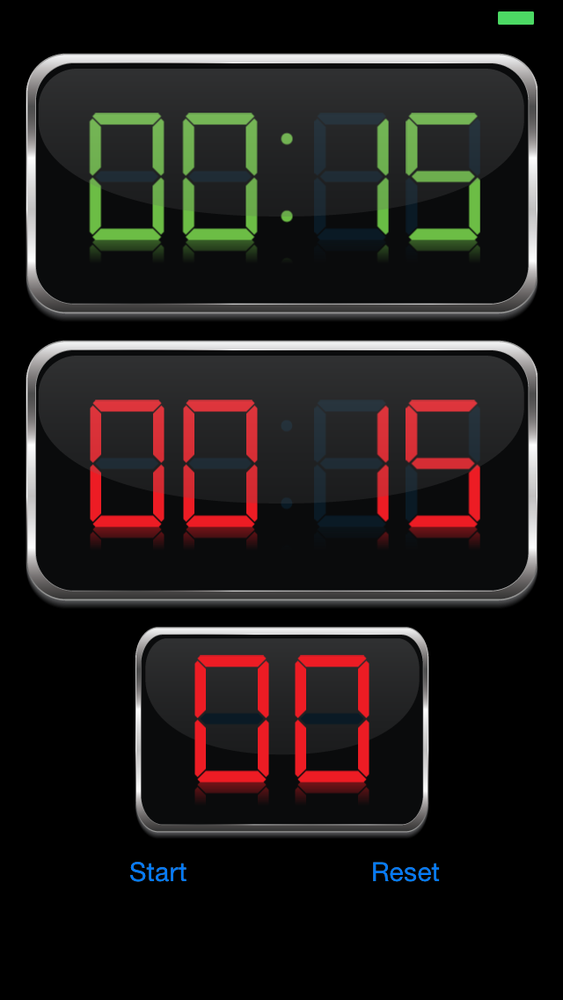
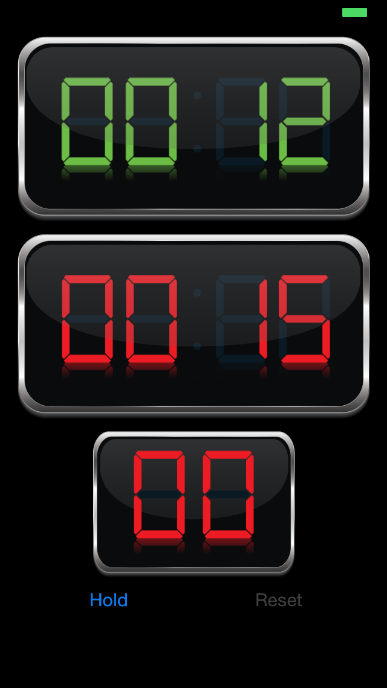
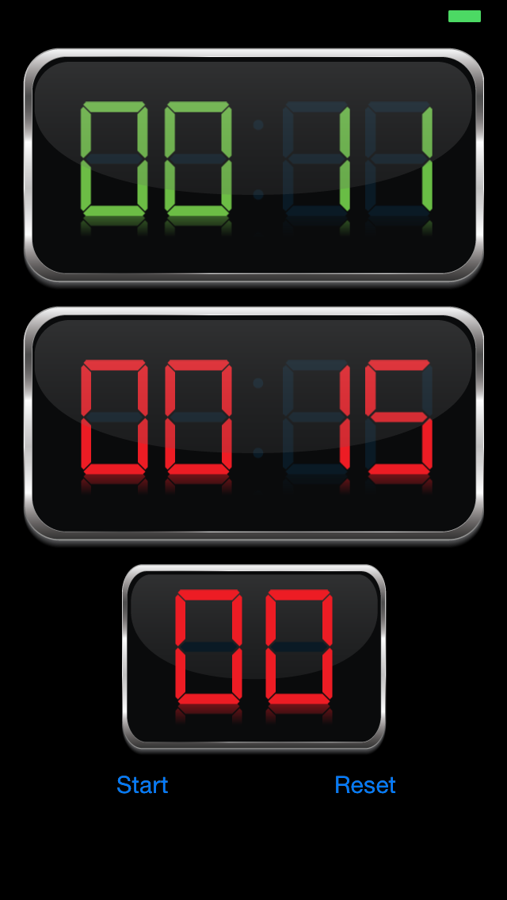

# BoxingTimer (Boxing Timer)
Simple boxing timer programmer.  It track time remaining within rounds, breaks between rounds, and the number of rounds that it is currently on. 
Technical goal of this program is to integrate graphic assets into a program, display custom graphical assets instead of plain vanila letters and fonts, and play sound

##Requirements
* XCode 6 or higher
* iOS 7 or higher
* Apple LLVM compiler
* ARC

## Features
PNG to display numbers, rather than using system fonts. Time tracking within rounds, alarm to stop round, alarm to start round, and track round #.  And of course Start, Hold, and Reset during rounds

